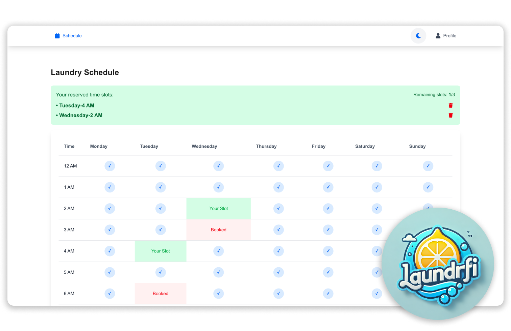

# LaundriFi - Smart Laundry Room Management System

<div align="center">
  
  
  [](https://nextjs.org)
  [](https://supabase.com)
  [](https://www.docker.com)
  [](https://www.postgresql.org)
  [](https://tailwindcss.com)
  [](https://crontab.guru)

  [Watch Demo](https://youtu.be/1uK_ddNC_T8) | [Live Site](https://laundrifi.vercel.app)
</div>

LaundriFi is a modern web application designed to streamline the management of apartment complex laundry rooms. It provides real-time machine availability tracking, reservation scheduling, and a user-friendly interface for residents to manage their laundry needs efficiently.

## ✨ Features

- **Real-time Machine Availability**: Live updates showing which machines are available, in use, or out of service
- **Smart Scheduling System**: Users can reserve time slots for laundry machines
- **User Authentication**: Secure login system with email verification
- **Reservation Management**: Users can view, modify, and cancel their reservations
- **Apartment Integration**: Links reservations to specific apartment numbers
- **Responsive Design**: Works seamlessly on both desktop and mobile devices
- **Dark Mode Support**: Comfortable viewing experience in any lighting condition

## 🛠️ Tech Stack

- **Frontend**: Next.js 14 with App Router
- **Styling**: Tailwind CSS
- **Authentication**: Supabase Auth
- **Database**: Supabase (PostgreSQL)
- **Deployment**: Vercel

## 🚀 Getting Started

### Prerequisites

- Node.js 18+ 
- npm or yarn
- Supabase account
- Vercel account (for deployment)

### Environment Variables

Create a `.env.local` file in the root directory with the following variables:

```bash
NEXT_PUBLIC_SUPABASE_URL=your_supabase_url
NEXT_PUBLIC_SUPABASE_ANON_KEY=your_supabase_anon_key
NEXT_PUBLIC_SITE_URL=http://localhost:3000
```

### Installation

1. Clone the repository:
```bash
git clone https://github.com/yourusername/laundrifi.git
cd laundrifi
```

2. Install dependencies:
```bash
npm install
# or
yarn install
```

3. Run the development server:
```bash
npm run dev
# or
yarn dev
```

4. Open [http://localhost:3000](http://localhost:3000) in your browser

## 📊 Database Schema

The application uses the following main tables:

- `reservations`: Stores laundry machine reservations
- `apartments`: Links users to their apartment numbers


## 🙏 Acknowledgments

- Built with Next.js and Supabase
- Icons from React Icons
- Styling with Tailwind CSS

---

<div align="center">
  Made by Me 😁
</div>
